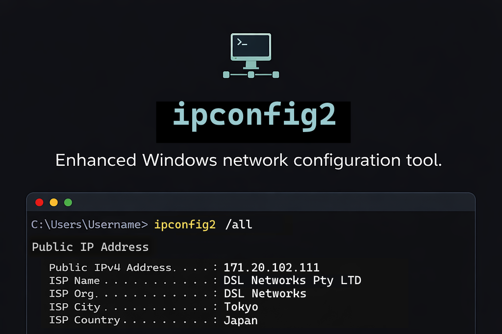

# 🌐 ipconfig2

**An enhanced Windows network configuration utility built in PowerShell.**

`ipconfig2` is a Windows command-line (CLI) network configuration utility for observing endpoint Public IP, ISP, and Geolocation information. Deploy this software to endpoints to gain the feature to verify device geo-location and Public IP address.

## 🚀 The Problem
When troubleshooting network connectivity or validating security policies, administrators often have to jump between the command line (for endpoint local IP info) and a web browser (to find endpoint public IP and location). This breaks workflow and adds friction. `ipconfig2` addresses this challenge.

## ✨ Key Features
* **External Context:** Automatically retrieves endpoint Public IP, ISP, and Geolocation data.
* **Unified View:** Combines local adapter details (Ethernet, Wi-Fi, Bluetooth PAN, and Virtual interfaces) with global Internet context.
* **No Browser Required:** Eliminate the need for web-based IP lookups during troubleshooting.
* **Network Management:** Includes built-in utilities like `/resetwinsock` directly via CLI switches.
* **Lightweight & Portable:** Run it as a native PowerShell script or download the compiled [Windows executable](https://github.com/hugoremington/ipconfig2/releases).

## 🛡️ Ideal Use Case: Security Validation
`ipconfig2` is specifically designed for testing [**Microsoft Entra ID (Azure AD) Conditional Access**](https://learn.microsoft.com/en-us/entra/identity/conditional-access/policy-block-by-location) and **Geoblocking** policies. Quickly verify if an endpoint's perceived location and IP range align with your organisational security posture.

---

## 🛠 Features

### 🌐 Public Network Information
- Public IP Address
- Public DNS Server
- ISP Name and ASN
- ISP Location (Geolocation)
- Timezone

### 💻 System Metadata
- Host Name
- Primary DNS Suffix
- Network Profile Name
- Network Profile Type
- IP Routing Status
- WINS Proxy Status
- DNS Suffix Search List
- IPv4 Connectivity
- IPv6 Connectivity

### ⚙️ Network Operations
- DHCP IP Release
- DHCP IP Renew
- Flush DNS cache
- Reset Winsock catalog
- Timestamp reporting

### 🔌 Network Interface Reporting
- Interface Name
- Interface Description
- Media State (Connected / Disconnected)
- Media Type (Ethernet, Wi-Fi, Bluetooth, Virtual)
- Physical MAC Address

### 📍 IP Addressing
- IPv4 Address
- IPv6 Address
- Subnet Mask
- Prefix Length
- Default Gateway
- DNS Server

### 📶 Wi-Fi Features
- Wi-Fi SSID
- Wi-Fi Key
- Wi-Fi Link Speed

### 📄 DHCP Information
- DHCPv4 Status
- DHCPv4 Server
- Lease Start/End Timestamps
- DHCPv6 Status
- DHCPv6 IAID
- DHCPv6 Client DUID

### 📊 Network Telemetry
- Link Speed (Mbps / Gbps)
- Received Bytes (MB)
- Sent Bytes (MB)

### 🚀 Additional Capabilities
- Install feature
- PATH environment variable to run directly from Terminal, PowerShell or CMD
- Bluetooth PAN adapter support
- Virtual adapter support (e.g. Hyper-V switches)
- Dynamic interface grouping (IPv4 + IPv6 per adapter)
- Graceful handling of no-internet scenarios
- Network profile report
- NetBIOS report
- Timestamp report
- Multi-threaded for performance
- Object oriented for modular source code control
- Save to TXT file capability using the [/outfile] switch

---

## 📝 To-Do
- Proactively optimise code.

---

## 📋 Requirements
- Windows OS
- PowerShell v5.0+ (older versions may work thanks to WMI backward compatibility)

---

## 📖 Usage

### Recommended Instructions
1. Install `ipconfig2.msi`
2. Launch Terminal, or PowerShell, or Command Prompt
3. Run `ipconfig2`
4. (Optional) Enter switches for additional output. `Example: ipconfig2 /all /version`

### Alternative Instructions
`powershell .\ipconfig2.ps1`

`cmd ipconfig2.exe`

---

### ⌨️ Parameter
```powershell
ipconfig2 [/all] [/flushdns] [/outfile:"C:\Temp\ipconfig2.txt"] [/release] [/renew] [/resetwinsock] [/version]
```

```
all             = Displays extended information including DHCP, physical mac, netbios and more.
flushdns        = Clears local DNS cache entries on system.
outfile         = Saves output to TXT file. You can specify a custom path using example [/outfile:"C:\temp\ipconfig2.txt"]. Default [/outfile] switch path is "$env:windir\Logs\ipconfig2" if no custom path is specified.
release         = Release DHCP IP addresses on local network interface cards on system with DHCP enabled.
renew           = Renew DHCP IP Address on local network interface cards on system with DHCP enabled.
resetwinsock    = Requires administrator privilege and system restart. Resets the Winsock catalog to a clean state, removing any custom LSPs to resolve network problems caused by corrupted Winsock settings. 
version         = Get utility version and attribution metadata.
```

---

## 🖼️ Gallery


---

## 🛠️ Changelog

### 1.0.1.0 - 06-Apr-2026
* New feature: Created a Windows Installer MSI package thanks to Advanced Installer.
* Install automatically provisions PATH environment variable, so you can run `ipconfig2` directly via terminal or CMD prompt without requiring app path/directoy. Simply type `ipconfig2`. You will need to re-open Terminal/CMD for environment veriable to take into effect. Automatic removal during uninstallation for sanitisation.
* Code optimisation: Omitted Get-SystemType redundant function from within threaded function Get-LocalNicIpData, as I can now parse $NetworkAdapterConfiguration from the main script function to $nicJob multithread scriptblock by using comma array -ArgumentList (,$NetworkAdapterConfiguration). Improved memory efficiency and performance.
* Various other bugfixes including omitting unnecessary params from `$allInfo = Get-AllSystemInfo` call.
* To do: Parse `$NetConnectionQuery = Get-NetConnectionProfile` from Get-Metadata to $nicJob without corrupting other args/params. This should optimise memory efficieny even further. Not a priority.
### 1.0.0.0 - 05-Apr-2026
* This release now completes version 1.0.0.0, as all definitions of done are now fulfilled. `ipconfig2` now supports most of the original data points as ipconfig.
* New feature: Save to file! It can now export the report as a TXT file using the /outfile switch. Supports the default OS log directory if no path is specified. (\Windows\Logs\ipconfig2). Capable with custom paths. Capable with folder creation (access required.)
* Overall performance optimisation thanks major code refactorisation including multithreads, memory param/return functions. Uses ~50% less memory than v0.5.0.6. Runs ~50% quicker.
* Major code refactor and optimisation: Deprecated all Write-Host commands, superseding it with memory using $output array. Output is now controlled and parsed using in memory by using params and return vars. This improves efficiency and is the approach for standardisation.
* Major code refactor and optimisation: Created new function called Invoke-SaveFile. Using this for save file operation. Now supports folder creation if directory does not exist. Also falls back to a default path of "$env:windir\Logs\ipconfig2".
* Major code refactor and optimisation: Enabled multithreading for big function Get-LocalNicIpData using $nicjob Start-Job. This should improve performance.
* Resolved $NetworkAdapterConfiguration parse error in $nicjob.
* ipconfig2 now detects if system support CIM, else falls back on WMI. This improves OS compatibility and robustness. Refactored in Get-AllSystemInfo function.
* Optimised memory efficieny even more by reducing class reference to Win32_NetworkAdapterConfiguration (retained a seperate instance in Get-LocalNICIpData function due to performance multithreading). Achieved this by calling the class only a single instance in Get-AllSystemInfo, and parsing in memory using return/param functions.
* Significantly improved /release and /renew functions. No more nested loops. Reporting accurately. Using memory where possible. With CIM and WMI fallback for legacy support.
* Due to a catch-22 situation, requiring metadata -> release/renew -> Get-LocalNic Ip data function and multithreading flow, I needed to seperate CIM/WMI system calls outside of the Get-Metadata function.
* Created a new function called Get-SystemType which detects if OS supports CIM/WMI. Then makes single call to class Win32_NetworkAdapterConfiguration. Memory efficiency.
* Appended necessary $args and validation logic to ensure /outfile successfully saves to custom path, and default environment log directory. Error and exception handling now in place as guardrails.
* Fixed a rare glitch where the Interface description would output redundantly during ipconfig2 /release. Now checking IPv4 and IPv6 duplicates correctly, even if no IP address exists or is obtaining DHCP.
* Omitted ipconfig2 /release, sleep-timer as a workaround solution, now that the root-cause is remediated.
* Supports both /resetwinsock and /winsockreset switches for the same function, as a typo fallback.
* Removed colourisation, due to $output memory replacing write-host. More streamline.
* Fixed a bug where /flushdns, /release, /renew, /resetwinsock functions were executing twice due to redundant calls in main args and Display-Output function. This has improved performance and resolved other cosmetic issues.
* Fixed a bug with nested loops within /release and /renew commands. Improved speed.
* Resolved DHCP /release /renew function output accuracy, now reporting correct interface(s), service and timestamps.
* DHCP Renew now only scoped to IPEnabled interfaces for speed.
* Now parsing $metadata out from Display-Output function as return var. Using this in other functions as params such as Invoke-SaveFile. Better memory optimisation, less system calls.
* Improved WiFi output; Now filtering for WiFi profile using $WifiProfileName and $netProfileType vars in Get-Metadata function.
* Fixed bug where IP output table contained stale entries post-release/renew commands. Resolved by re-ordering args switches in Dislay-Output function.
* Additional checks in output for WiFi connected vs disconnected to display last known ssid/key.
* Various other bugfixes and improvements.
* Bug: Wi-Fi output can be inaccurate if you release/renew WiFi NIC DHCP, but will report correctly after reconnection to SSID.
### 0.5.0.6 - 03-Apr-2026
* New feature: Net node type, which detects NetBios node types including Broadcast, Peer-Peer, Mixed, Hybrid. Now available in metadata section.
* Added new timestamp feature and the end of report. Useful for artefact production.
* Code optimisation, reduced registry query variables by consolidating and removing unused.
* Other tweaks and fixes.
### 0.5.0.5 - 03-Apr-2026
* Code optimisation; Complete code is now in modular functions, except for Args and Calls.
* Fixed Netbios over tcpip data point. Now reporting correctly.
* Fixed primary dns suffix and dns suffix search list data points. Now reporting correctly, and applied methods to removed empty array values.
* Fixed wifi ssid/key reporting accuracy. Was previously broken due to null var $netProfileName, which I have now parsed into Get-LocalNicIpData using $netProfileName = (Get-AllSystemInfo).Metadata.NetProfileName.
* New /all switch using $showAll var bool flag, to display extended information including DHCP, DNS, Public ISP, disconected interfaces, and more. 
* Default output is now succinct.
### 0.5.0.4 - 02-Apr-2026
* New /flushdns function. Will report on total stale DNS cache entries and clear in one go.
* New /resetwinsock function. Resets the Winsock catalog to a clean state. Handy feature.
* Replaced static variables with $null and $LASTEXITCODE for propert exception handling in /release and /renew functions. Useful for exception handling when using cmd such as netsh.
* Bug fix reporting and fault-tolerance for /release and /renew functions. Now with CIM and WMI fallback properly detecting success/failure exceptions and fault tolerance between both methods. Preferring modern CIM first.
* New timestamp feature, now reports on operations.
* Various fixes and tweaks.
### 0.5.0.3 - 01-Apr-2026
* Changed the conditions for displaying received/sent bytes to if greater than zero, rather than if media state is connected. Useful for observing stats retrospectively on disconnected interfaces.
* This also fixes output for missing data point interfaces such as Bluetooth that do not have this telemetry yet.
### 0.5.0.2 - 01-Apr-2026
* Improved DHCP release/renew functions to use modern CimInstance methods. Retained classic WMIObject methods as a fallback using try/catch blocks.
* Improved output table even more. Now more efficient and consistent with less foreach loops. 
* More output now visible irrespective to media state, such as physical MAC address, dhcp, and more.
* Improved metadata table which now dynamically displays multiple network profiles where available.
* Slight formatting tweaks.
### 0.5.0.1 - 01-Apr-2026
* Minor cosmetic bug fix with line spacing before/after release/renew commands.
* Improved cosmetic line spacing after splash screen, more consistent with entire script.
### 0.5.0.0 - 01-Apr-2026
* April Fool's Day major update, this release is no joke!
* New DHCP v4 and v6 release feature. Factored in new function called Invoke-IPConfigRelease. This is independent from Windows native ipconfig and a viable fallback feature.
* New DHCP v4 and v6 renew feature. Factored in new function called Invoke-IPConfigRenew. This is independent from Windows native ipconfig and a viable fallback feature.
* Now supporting NICs with multiple IP addresses! This was not working previously due to output syntax.
* Now displays hidden DHCP 169.254 addresses.
* Implemented new line break concatenation for multiple output values using (-join "`n                                         "). This now grants streamline output structure for elements such as NIC DNS server.
* Refactored output tables, resolving multiple duplication bugs and hidden values.
* Resolved duplicate NIC rows when releasing DHCP IP.
* Resolved value duplication in metadata output when releasing DHCP IP. By filtering basic using ( | Select-Object -First 1) in metadata output table.
* Implemented start-sleep timer after IP release to compile output table correctly.
* Significantly improved IP release/renew performance times within Invoke functions by filtering with where-object logic: $_.InterfaceIndex -eq $($adapter.IfIndex). More efficient.
* Appended IPv4 and IPv6 distinguishment for subnet prefix length.
* Sort-object when releasing/renewing IPs by InterfaceMetric number. This now resolves the bug where NICs would sequentially failover and not be scoped for DHCP release.
* Fixed IP release by omitting logic IPEnabled, ensuring even disconnected NICs drop their DHCP lease.
* Got IPv6 Link-local and Address subnet prefix length display to function.
* Numerous bug fixes.
### 0.4.1.2 - 31-Mar-2026
* Cosmetic change: renamed Ethernet Adapter section to Network Interface Card.
* Cosmetic change: renamed Network Profile Category to Network Profile Type.
### 0.4.1.1 - 31-Mar-2026
* Fixed network profile category not appearing in certain conditions.
* Appended Internet connectivity checks in metadata.
* Fixed display wording for Autoconfiguration enabled.
* Fixed display wording for NetBIOS over Tcpip.
### 0.4.1.0 - 31-Mar-2026
* Appended network profile category into metadata output table.
* Refactored IPv6 output, omitted LocalLinkAddress from retun tables. Appended better logic in output display area for both IPv4 and IPv6 sections.
* Fixed External DNS Server reporting by appending -join operator for multi support.
* Omitted $cleanIPv6.
* Omitted duplicate Media Type output code in both if/else conditions.
* Media Type now displays nicely underneat Media State.
* Slight re-wording and optimisation.
### 0.4.0.9 - 30-Mar-2026
* Resolved metadata output line spacing.
### 0.4.0.8 - 30-Mar-2026
* Removed multi-threading for Get-Metadata as it is slower when multithreading in function, might be quicker to multithread when there are multiple functions greater than 2.
* Reinstated ISP ZIP Code data point.
### 0.4.0.7 - 30-Mar-2026
* This release brings performance improvements.
* Removed redundant Get-Isp nested function inside MAIN Get-AllSystemInfo function. Reducing unnecessary threads and improving performance.
* Applied multi-threading jobs for Get-Metadata nested function inside Get-AllSystemInfo parent function. This may improve performance, as it is the longest execution time element in the source code atm. 
* Omitted redundant API call to "https://ipinfo.io/json". Improving performance.
* Optimised Get-Isp return array, to match new REST API telemetry.
* Optimised Get-Metadata function to use $tcpipParams.PSObject memory instead of four Get-ItemProperty system registry calls. Improved performance.
* Resolved public DNS retrieval. Now reflecting accurately thanks to whoami.akamai.net.
* Fixed $ip conflict in both IPv4 and IPv6 contexts, risk of leak. Now using $ipV4 and $ipV6.
* Fixed duplicate data in Local-link IPv6 Address field. Separated Local-link from manual address for IPv6. New if/else conditions for display of manual IPv6 address.
* Performed sanitisation using $cleanIPv6 to remove whitespace(s).
* Added new AddressState data point in return arrays for both IPv4 and IPv6 for (Preferred/Deprecated) reporting. Will need to utilise this in future releases.
* Omitted redundant Public DNS Server section.
* Updated output tables to match new categories and return variables.
* Code formatting, organisation and tweaks.
### 0.4.0.6 - 30-Mar-2026
* Significant performance boost by tweaking MAIN Get-AllSystemInfo function omitting nested jobs/threads. Using return arrays over vars.
### 0.4.0.5 - 30-Mar-2026
* Fixed $dhcpEnabledV4 semantics for Yes/No after logic if/else checks for consistency.
* Small performance tweaks by omitting redundant netsh commands and using $netshQuery instead.
* Enabled experimental reporting of additional NICs/IPs by omitting "$_.IPAddress -notmatch "^169\.254" -and $_.PrefixLength -ne 0 -and" from $ipv4Addresses and $ipv6Addresses vars.
* Testing and validation of DHCPv6Enabled status. Verified accuracy.
* Fixed redundant IPv6 Link row output.
* Performance optimisation, moved $networkAdapters, $dnsClients, Get-NetRoute, Get-DnsClientServerAddress outside of foreach loop, improving data collection.
* Fixed DNS Suffix Search List registry reference.
* Fixed DHCPv4 & DHCPv6 output tables and conditional output.
### 0.4.0.4 - 29-Mar-2026
* Fixed $autoConfigurationBinding now reporting correctly thanks to netsh DAD Transmits data point.
### 0.4.0.3 - 29-Mar-2026
* Fixed missing variable $firstIPv6.
* Fixed netbios binding via $netbiosEnabled = if ($netbiosEnabled -eq $True) { "Enabled" } else { "Disabled" }.
* Minor bug fix with $autoConfigurationBinding = Get-NetIPAddress.
### 0.4.0.2 - 29-Mar-2026
* Implemented new master function called Get-AllSystemInfo which combines System Metadata, Public IP and Public DNS calls for parallel processing using jobs/threads. Performance improvement.
* Omitted former independant functions Get-Isp and Get-Metadata.
### 0.4.0.1 - 29-Mar-2026
* Implemented new function Get-Isp and function call for modular approach.
* Implemented new function Get-Metadata and function call for modular approach.
* Performance improvement by incorporating start-jobs in Get-Isp and Get-Metadata.
* Fixed Primary Dns Suffix data.
* Fixed Dns Suffix Search List data.
### 0.4.0.0 - 29-Mar-2026
* Fixed NetBIOS reporting.
* New feature Bluetooth adapter reporting.
* New compact ico for compile release.
* New feature DHCP AutoConfiguration now working.
* New feature Network Transfer Statistics in MB including ReceivedBytes and SentBytes for connected interfaces.
* Performance improvement by using multi-threaded jobs for tandem REST calls.
* Garbage cleanup optimisation.
* Code clean up.
### 0.3.1.6 - 28-Mar-2026
* New feature WiFi SSID output thanks to netsh profile match.
* New feature WiFi Key thanks to netsh profile match with key=clear.
* WiFi SSID and Keys now only reporting for matching 802.11 wifi adapters only, with if/else checks.
* Formatting tweaks, made NIC Description at top of each interface output.
### 0.3.1.5 - 28-Mar-2026
* New feature system metadata top section including host name, primary dns suffix, net profile name, ip routing, wins prox and dns suffix search list.
* New feature DHCP reporting including v4/v6, status, server, lease, IAID and Client DUID.
* Resolved DUID binary to hex issue.
* DHCP section is dynamic, based on enabled status.
* DHCP v4 and v6 lease durations now available in readable date format, converted from unix time.
* Additional bugfixes.
* To do: Add node type into system metadata section.
### 0.3.1.4 - 28-Mar-2026
* Added link speed feature.
* Added Media State feature.
* Added if/else checks if media state is down then report succinctly.
### 0.3.1.3 - 28-Mar-2026
* Omitted $publicIP to remove redundancy and improve performance.
### 0.3.1.2 - 28-Mar-2026
* Code optimisation and performance improvement for $getAllIpAddresses = Get-NetIPAddress now executing once.
* IPv6 now displays below Connection-specific DNS Suffix.
* Resolved $MyIspDNSInfo nested variable.
### 0.3.1.1 - 28-Mar-2026
* Resolved bug No MSFT_DNSClient objects found with property 'InterfaceIndex' equal to 'X'. Verify the value of the property and retry.
* Fixed local DNS duplication.
### 0.3.0.0 - 28-Mar-2026
* Now checks Internet connectivity using $noInternet flag thanks to try/catch blocks on Invoke-RestMethod calls.
* Public IP Address and Public DNS Server reports will not output if $noInternet -eq $true.
* Optimised code by omitting redundant API calls and replacing with objects instead. Drastically improved performance.
* Appended metadata.
* Fixed redundant NIC output, combining IPv4 and IPv6 in the same interface.
* Improved stability with additional try/catch blocks.
* New feature: local NIC DNS Suffix and MAC Address.
* Formatting and tweaks.
### 0.2.0.0 - 28-Mar-2026
* Now working public DNS server feature using REST API call.
* Includes DNS server locale.
* Appended public IP locale.
* Got subnet mask output working.
### 0.1.0.0 - 28-Mar-2026
* Got public IP address working.
* Initial draft.

---

## 🪪 Attribution & License

Author: Hugo Remington

License: MIT

Compiled as an EXE using [MScholtes/PS2EXE](https://github.com/MScholtes/PS2EXE)

Public IP retrieval using REST API via free provider [ip-api.com](https://ip-api.com). Public DNS retrieval via `whoami.akamai.net`. Licensing is subject to their terms and conditions.

---
